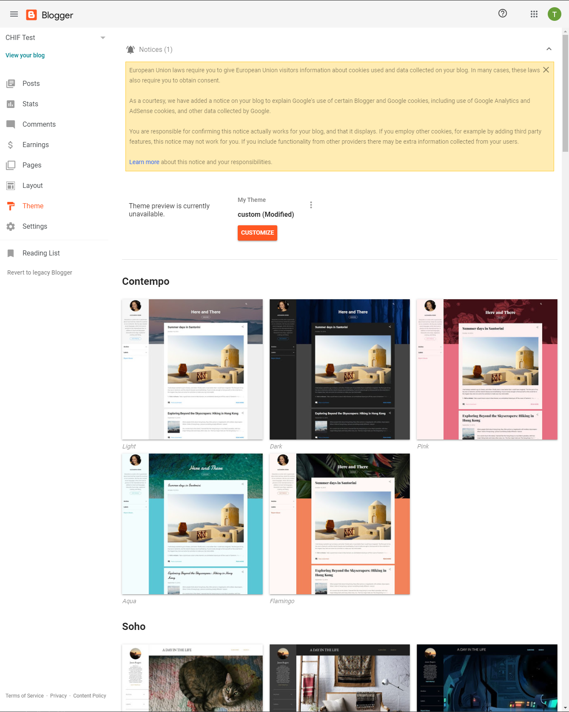
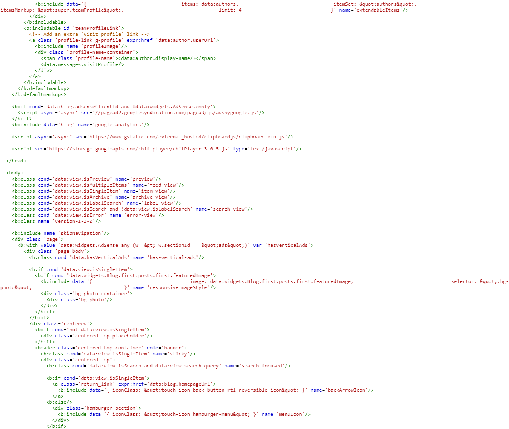
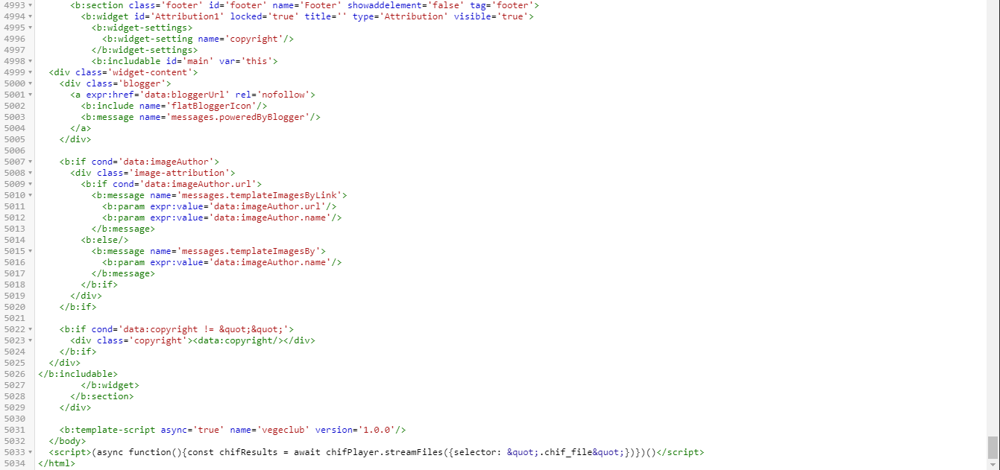
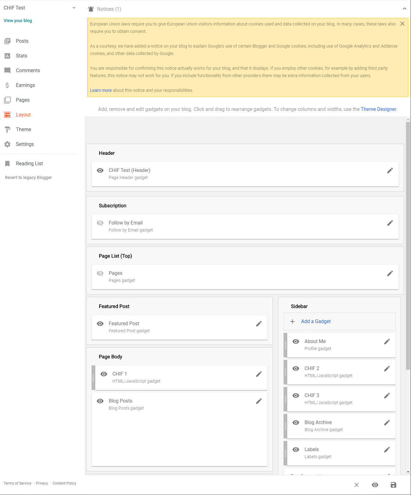
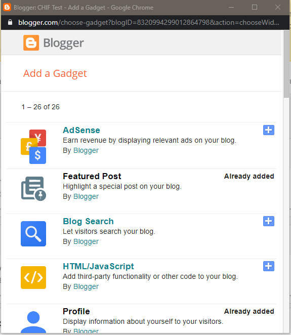
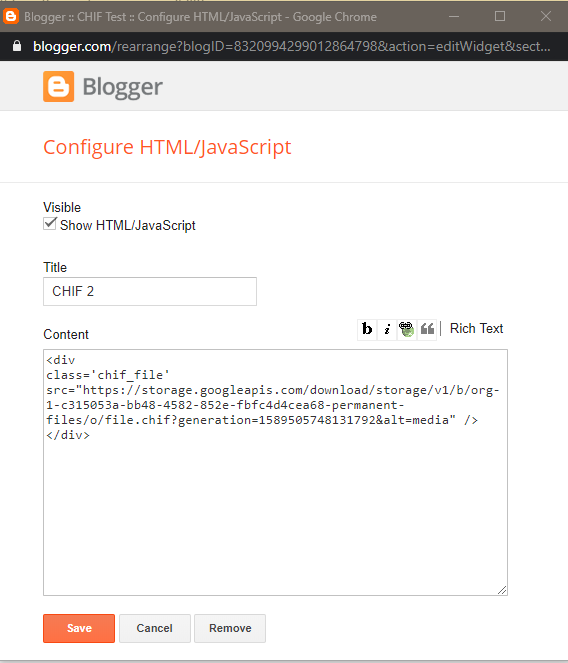
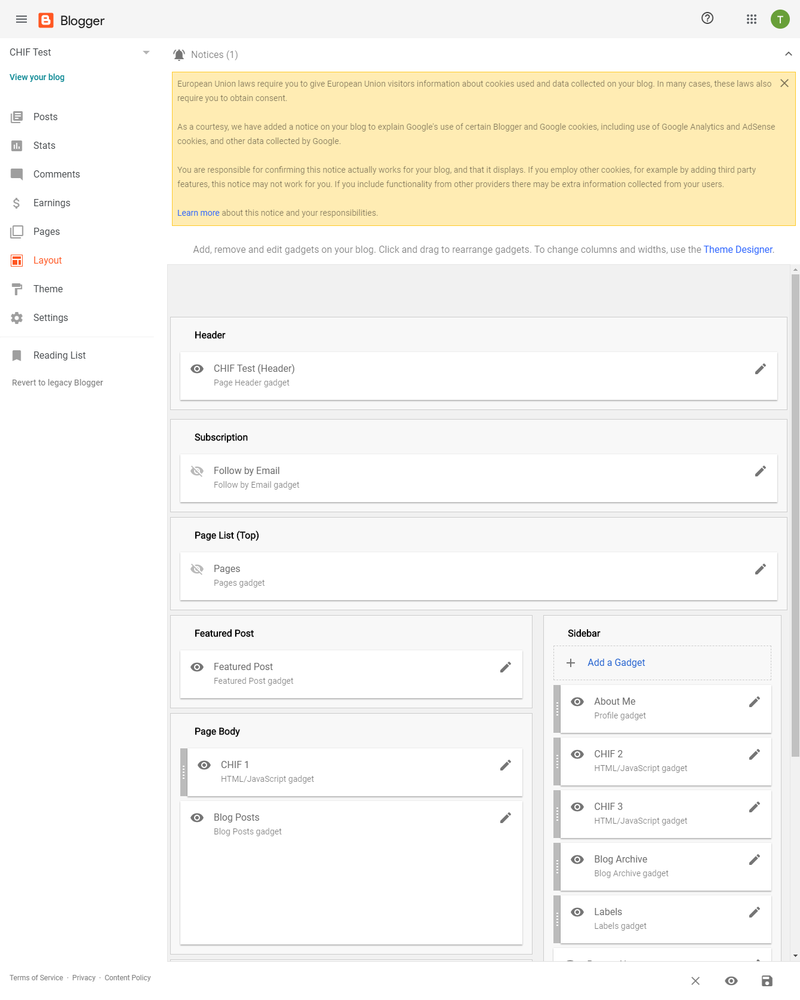

## Blogger integration example

This will help you start embedding CHIF files into a Blogger site.

## 1. Place A CHIF in Blogger:

Naviage to theme and select the triple dot button and select edit html:



place the script below inside the header.

```html
<script type="text/javascript" src="https://storage.cloud.google.com/chif-player/chifPlayer-[version].js"></script>
```



place script after the body tag:

```html
<script>
	(async function(){const chifResults = await chifPlayer.streamFiles({selector: '.chif_file';})})()
</script>
```



Save the file.

Enter the layout page and select add a gadget:



Select the HTML/Javascript gadget:



Place the following div tag:

```html
<div class="chif_file" src="CHIF URL"></div>
```



Select View your blog:



In the `<script>` tag above, replace `[version]` with the version number of the player in use.

In the `<chear>` tag above, replace `src="CHIF URL"` with the path to your CHIF File.
