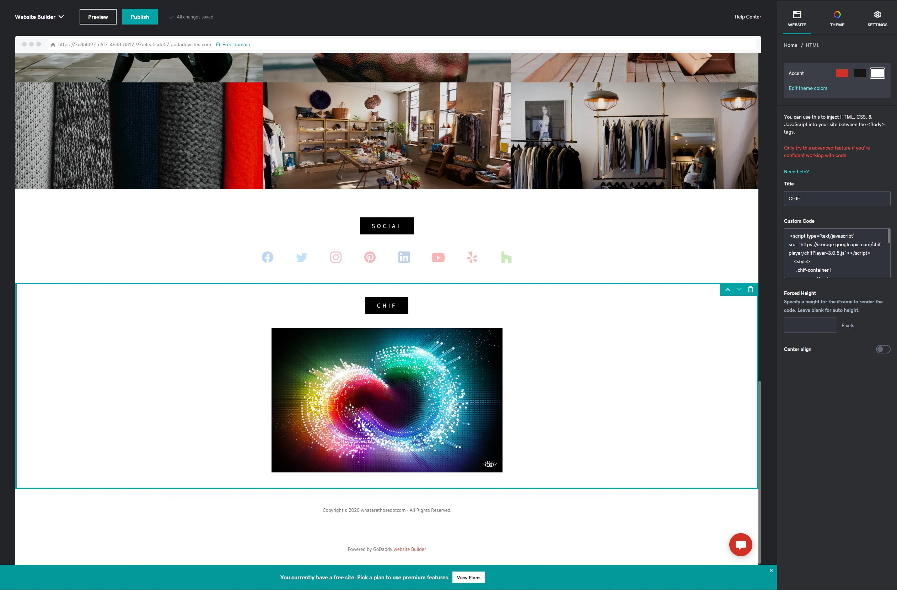

## GoDaddy integration example

This will help you start embedding CHIF files into a GoDaddy site.

## 1. General Reference Docs:

https://www.godaddy.com/help/add-html-or-custom-code-to-my-site-27252

## 2. Place A CHIF in GoDaddy website builder:

Locate the Add HTML inside the builder and select a location for the chif and add the following script:



```html
<script type="text/javascript" src="https://storage.cloud.google.com/chif-player/chifPlayer-[version].js"></script>
<style>
	.chif-container {
		margin: 0 auto;
		width: 650px;
	}
</style>
<chear src="CHIF URL"></chear>
<script>
	chifPlayer.streamFiles();
</script>
```

```<style>``` allows css to modify the player html to fit the iframe

In the `<script>` tag above, replace `[version]` with the version number of the player in use.

In the `<chear>` tag above, replace `src="CHIF URL"` with the path to your CHIF File.
