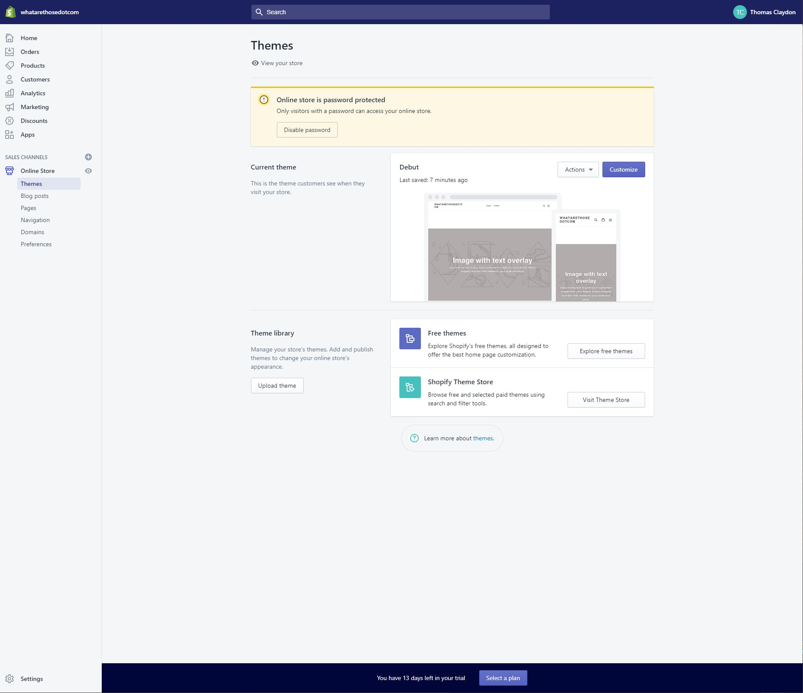
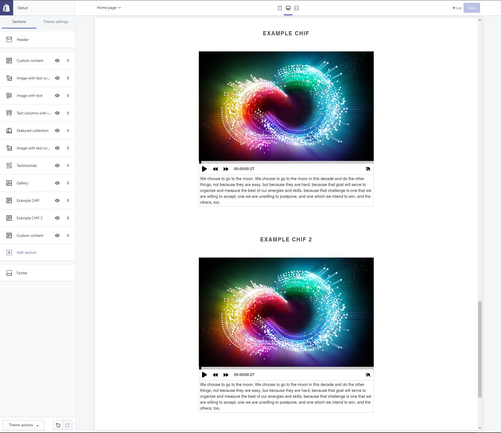
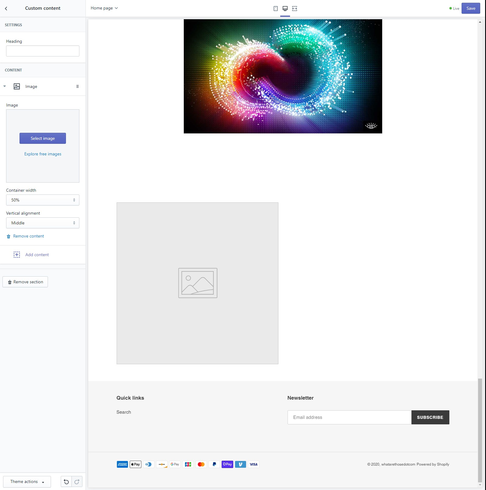

## Sopify integration example

This will help you start embedding CHIF files into a Sopify site.

## 1. General Reference Docs:

developer customization (requires coding): https://www.youtube.com/watch?v=78N7hRwIZO4

HTML through integrated designer:

https://www.youtube.com/watch?v=PrvZuZH16KY

https://docs.ecomfy.io/

add on (html/css/js) to integrated designer (not necessary): https://www.youtube.com/watch?v=qEk5DgXE4Iw

add on (js) to integrated designer (not necessary): https://www.youtube.com/watch?v=9Tv4Qm1qRR0

## 2. Place A CHIF in Shopify Integrated Designer:

Locate the theme’s section of the online store.



Select customize.



Select add section.

Select custom content and add.

Remove placeholder content and header text.



Select add content => custom html in the text area add the player script and styling:

```html
<script type="text/javascript" src="https://storage.cloud.google.com/chif-player/chifPlayer-[version].js"></script>
<style>
.chif-container {
    margin: 0 auto;
    width: 650px;
}
</style>
```

Save the website and move the new custom content to the top of the page.

Add CHIF:

Follow the same instructions above and replace the custom html with:

```html
<chear src="CHIF URL"></chear>
```

Save the site and move the custom content to the location in which you want it to be rendered.

Add player script:

Follow the same instructions above and replace the custom html with:

```html
<script> chifPlayer.streamFiles() </script>
```

Save the site and move the custom content to the bottom of the page, make sure the script is below the chif.

```<style>``` provides the ability to modify the player styling via css.

In the `<script>` tag above, replace `[version]` with the version number of the player in use.

In the `<chear>` tag above, replace `src="CHIF URL"` with the path to your CHIF File.
