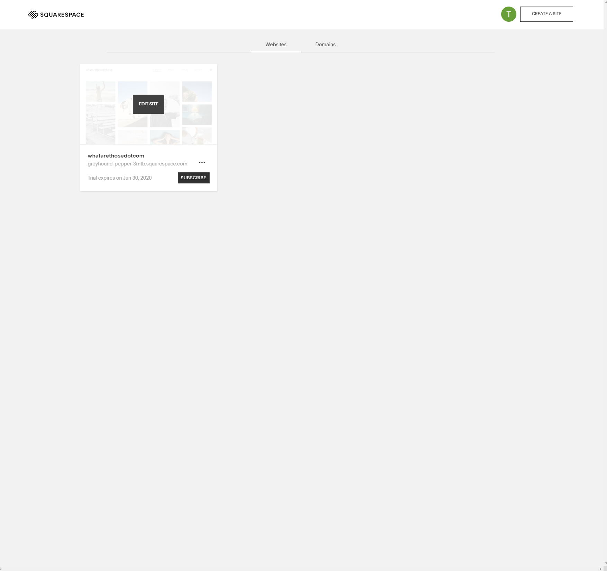
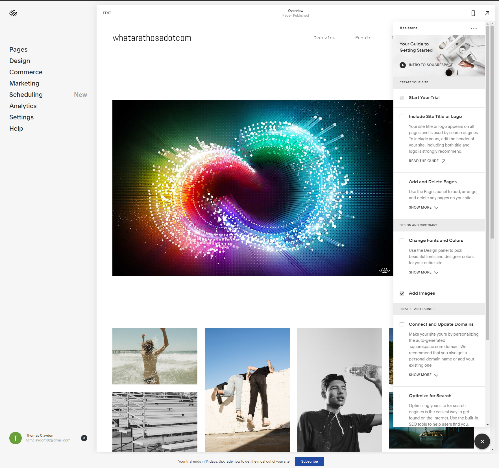
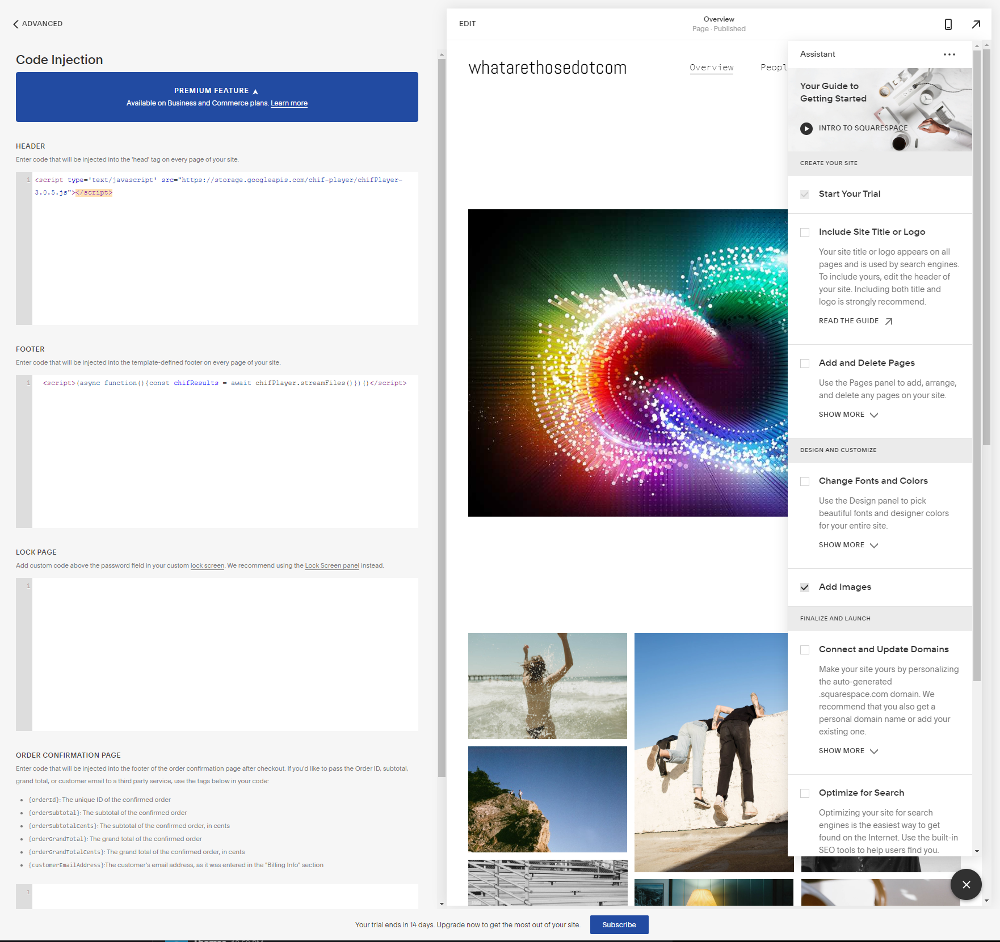
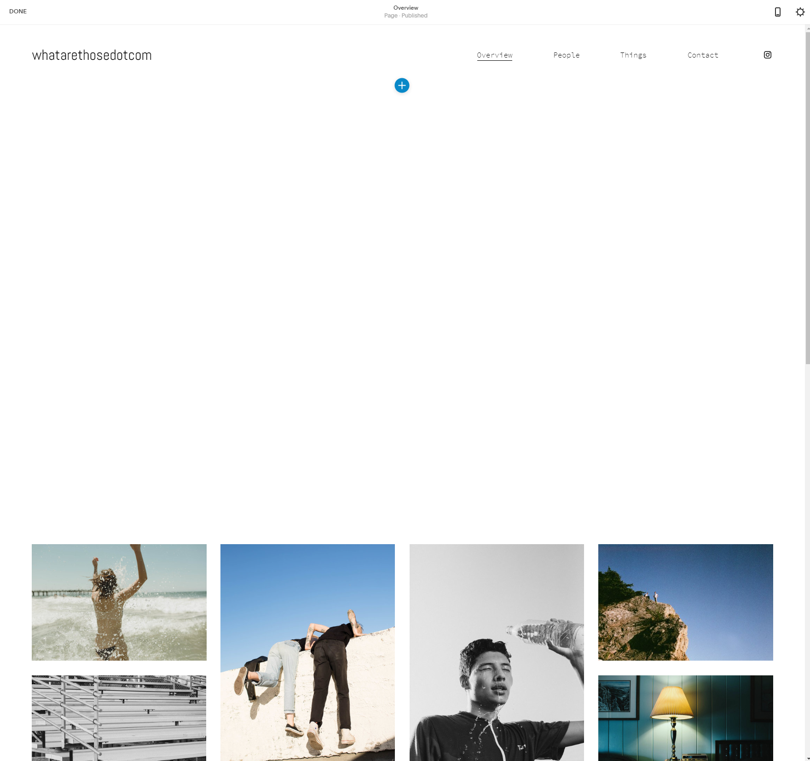
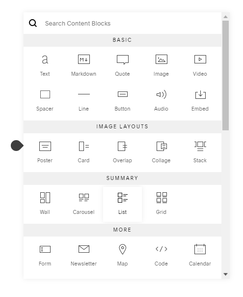
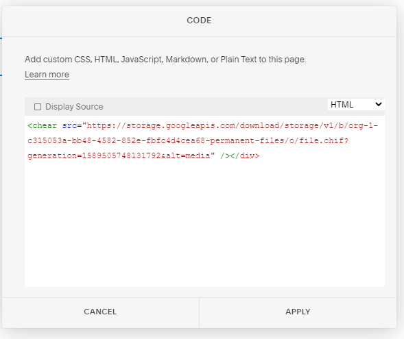

## Square Space integration example

This will help you start embedding CHIF files into a Square Space site.

## 1.General Reference Docs:

https://support.squarespace.com/hc/en-us/articles/205815908

## 2. Place A CHIF in Square Space:

Create a site and enter the editor:



Once your in the editor:



Navigate to settings/advanced/code injection:



place the script below inside the header.

```html
<script type="text/javascript" src="https://storage.googleapis.com/chif-player/chifPlayer-[version].js"></script>
```

Place script after the body tag:

```html
<script>
	(async function () {
		const chifResults = await chifPlayer.streamFiles();
	})();
</script>
```

Save the changes.

Click Edit to edit the page and click the add button:



Add a code block to the page:



Place the chear tag inside the body as html:

```html
<chear src="[chif url]" /></div>
```



Apply and save the file.

In the `<script>` tag above, replace `[version]` with the version number of the player in use.

* [Player Version Link/General Implementation](../../player/playerimplementation.md)

In the `<chear>` tag above, replace `src="[chif url]"` with the path to your CHIF File.