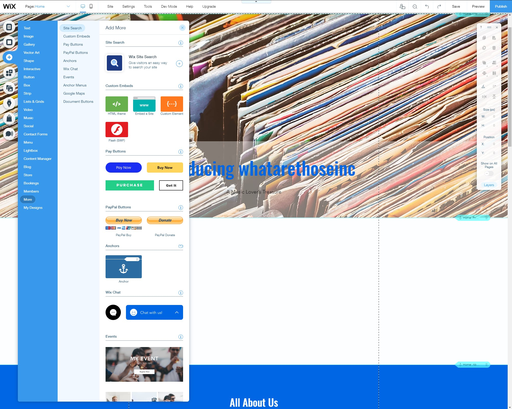
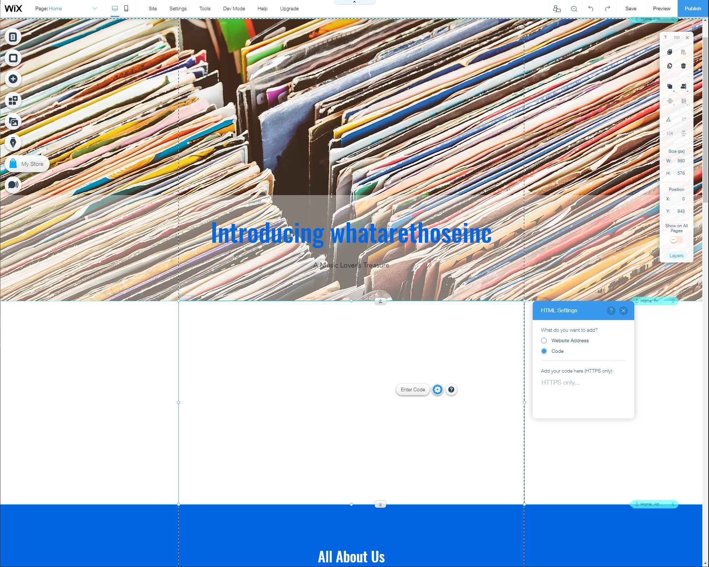
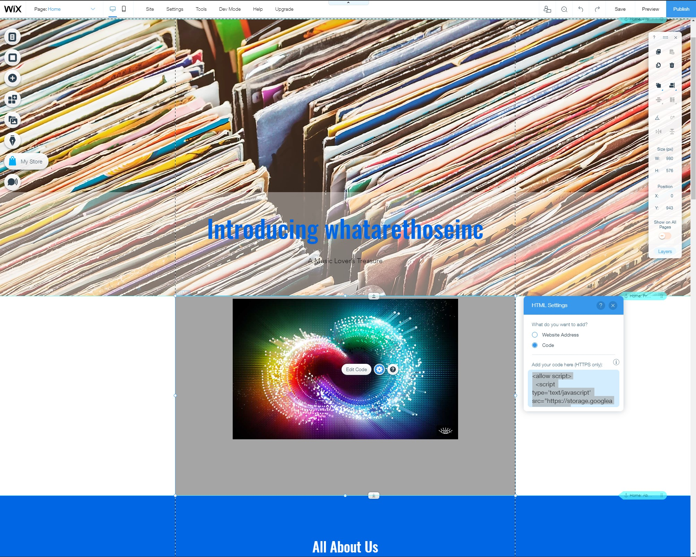

## Wix integration example

This will help you start embedding CHIF files into a Wix site.

## 1. General Reference Docs:

https://www.wix.com/corvid/forum/community-discussion/adding-code-in-header-footer

https://support.wix.com/en/article/header-code-meta-tag-guidelines

https://support.wix.com/en/article/embedding-custom-code-to-your-site

https://support.wix.com/en/article/custom-code-loading-options

custom html example: https://www.bing.com/videos/search?q=wix+custom+html+in+body&docid=608039396028124223&mid=E03012137EA1739609C8E03012137EA1739609C8&view=detail&FORM=VIRE

custom scripts iframe example: https://www.youtube.com/watch?v=pG-RnEE7nUw

## 2. Place A CHIF in Wix:

From the site editor follow the path / ADD / More / HTML iframe to add an iframe.



Place the iframe in the site.



Add the CHIF via the following script.



```html
<allow script>
	<script type="text/javascript" src="https://storage.cloud.google.com/chif-player/chifPlayer-[version].js"></script>
	<style>
		.chif-container {
			margin: 0 auto;
			width: 650px;
		}
	</style>
	<chear src="[chif url]"></chear>
	<script>
		(async function () {
			const chifResults = await chifPlayer.streamFiles();
		})();
	</script></allow
>
```

`<allow script>` allows the javascript player to run in the iframe.

`<style>` provides the ability to modify the player styling via css.

In the `<script>` tag above, replace `[version]` with the version number of the player in use.

* [Player Version Link/General Implementation](../../player/playerimplementation.md)

In the `<chear>` tag above, replace `src="[chif url]"` with the path to your CHIF File.
