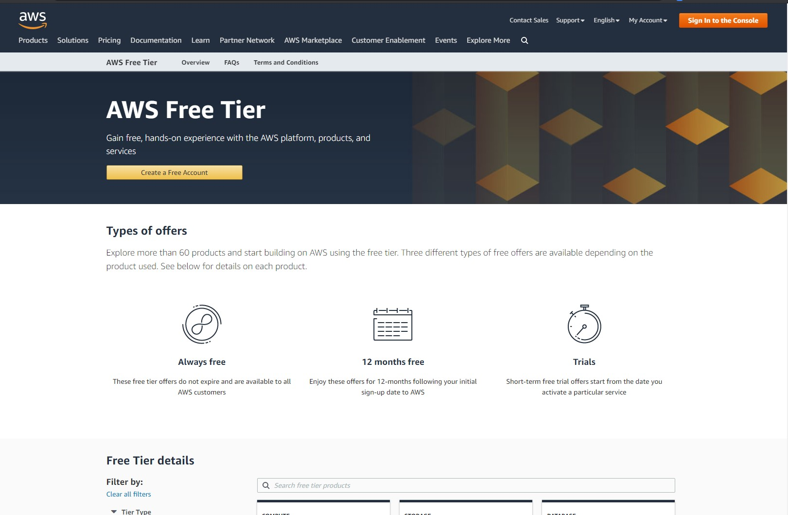
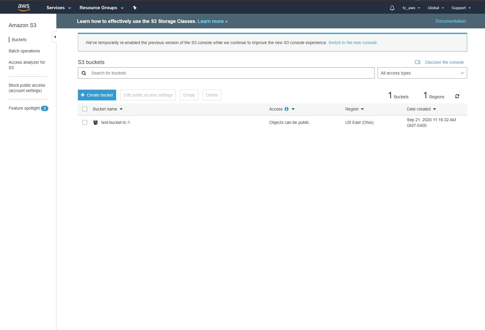
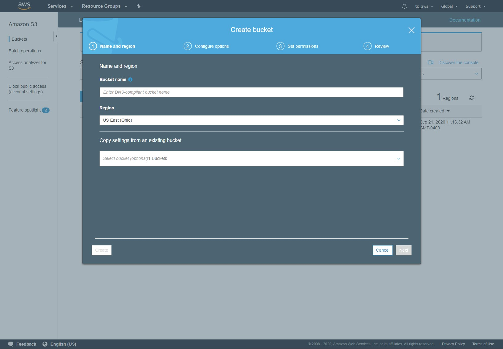
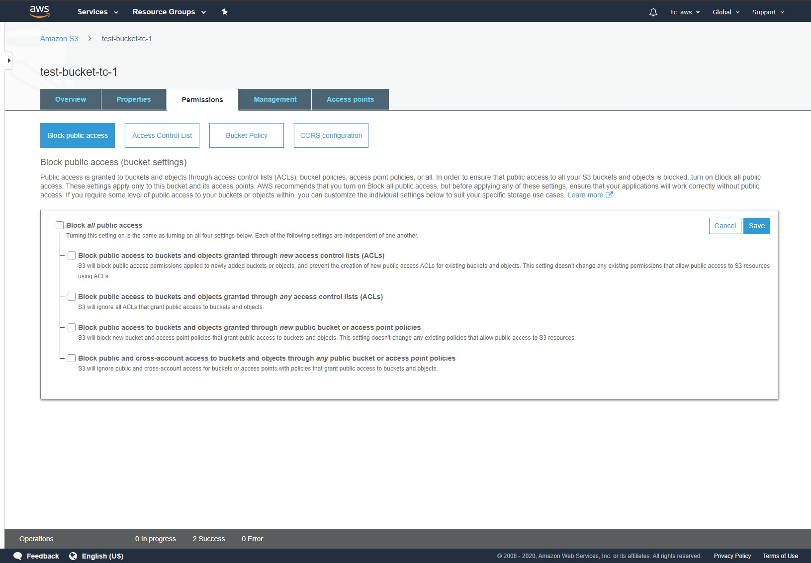
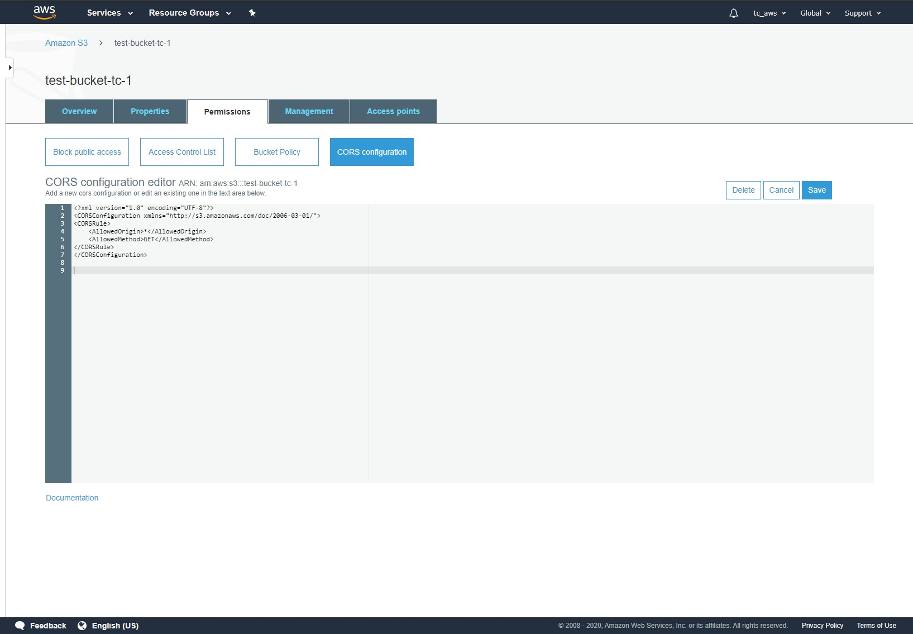
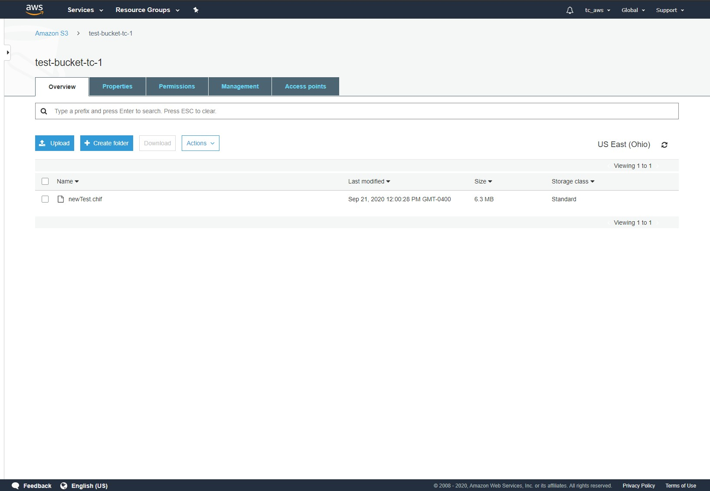
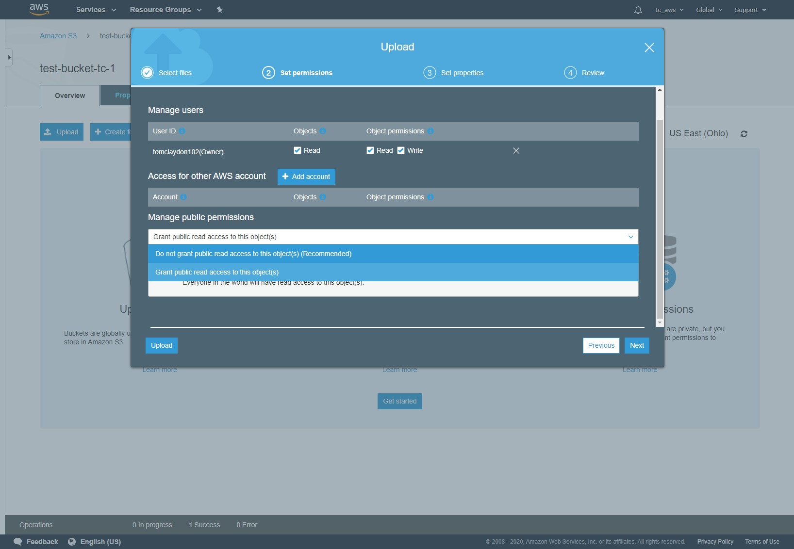
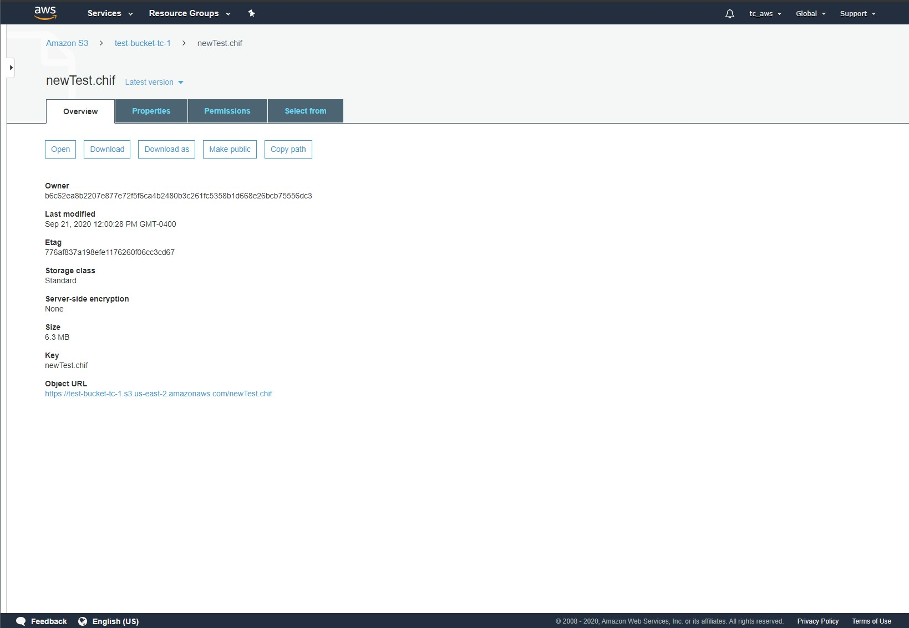

# Amazon Web Services (AWS) S3 CHIF Storage

## Navigation

-   [Getting Started](#getting-started)
-   [AWS Signup](#aws-signup)
-   [S3 Pricing](#s3-pricing)
-   [AWS Console](#aws-console)
-   [Create Bucket](#create-bucket)
-   [S3 Permissions](#s3-permissions)
-   [Upload a CHIF](#upload-a-chif)

## Getting Started

These docs will provide an overview of signing up for a free tier AWS account, creating a S3 bucket, bucket permissions and file storage.

## AWS Signup

Sign up for AWS [Free Tier](https://aws.amazon.com/free) Account.



## S3 Pricing

Free Tier is limited in duration, eventually you will be required to upgrade and pay for the service. See pricing here [S3 Pricing](https://aws.amazon.com/s3/pricing).

## AWS Console

The AWS Console provides the functionality of creating buckets, uploading files and setting bucket permissions.

[Bucket Console](https://console.aws.amazon.com/s3/home)



## Create Bucket

Go to the [Bucket Console](https://console.aws.amazon.com/s3/home) and select create bucket.

Enter a bucket name, Select a region and click create.



Enter the new bucket by clicking the bucket name.

In order for a website to access your CHIFS we need to update the bucket permissions.

## S3 Permissions

Select the permissions tab and Block Public Access.

Deselect Block all public access and click save.



Go to CORS configuration.

For Complete Public Access Paste the following XML into the CORS config editor and click save.

```
<CORSConfiguration>
 <CORSRule>
   <AllowedOrigin>*</AllowedOrigin>
   <AllowedMethod>GET</AllowedMethod>
 </CORSRule>
</CORSConfiguration>
```

See [Set Bucket CORS Documentation](https://docs.aws.amazon.com/AmazonS3/latest/dev/cors.html) for further options.



## Upload A CHIF

Upload your CHIF to the bucket.



Once the Upload Modal appears Click Next to set file permissions.

Click the Manage public permissions and select `Grant public read access to this object(s)`

Finally click upload.



Obtain the public url by clicking in the file name and Copy the Object URL.



Now you are ready to use your CHIF. 
