# Google Cloud Provider (GCP) CHIF Bucket Storage

## Navigation

-   [Getting Started](#getting-started)
-   [GCP Signup](#gcp-signup)
-   [Storage Pricing](#storage-pricing)
-   [GCP Console](#gcp-console)
-   [Create Bucket](#create-bucket)
-   [Storage Permissions](#storage-permissions)
-   [Upload a CHIF](#upload-a-chif)

## Getting Started

These docs will provide an overview of signing up for a free tier GCP account, creating an bucket, bucket permissions, file upload and file reference url.

## GCP Signup

Sign up for GCP [Free Tier](https://cloud.google.com/free) Account.

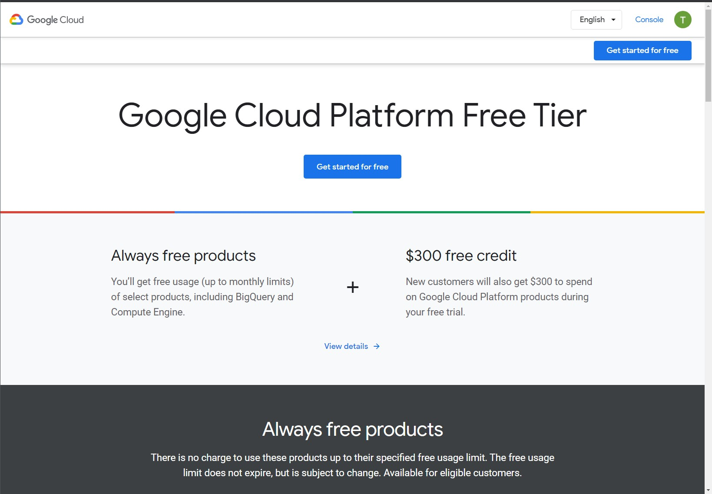

## Storage Pricing

Free Tier is limited in duration, eventually you will be required to upgrade and pay for the service. See pricing here [Storage Pricing](https://cloud.google.com/storage/pricing).

## GCP Console

The GCP Console provides the functionality of creating buckets, uploading files and setting bucket permissions.

[Bucket Console](https://console.cloud.google.com/storage)

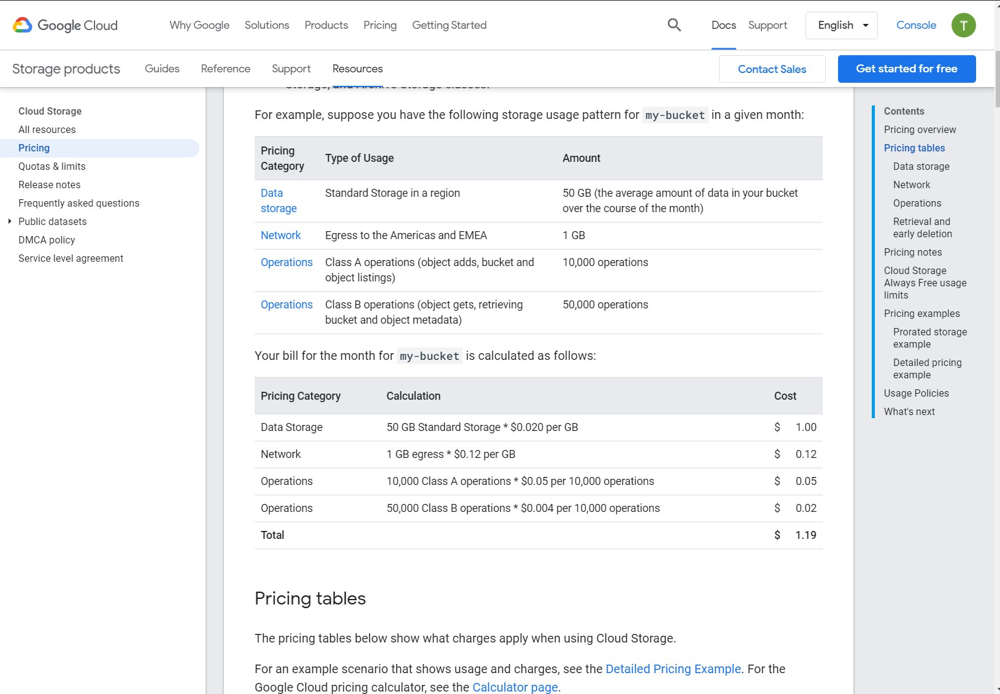

## Create Bucket

Go to the [Bucket Console](https://console.gcp.amazon.com/Storage/home) and select create bucket.

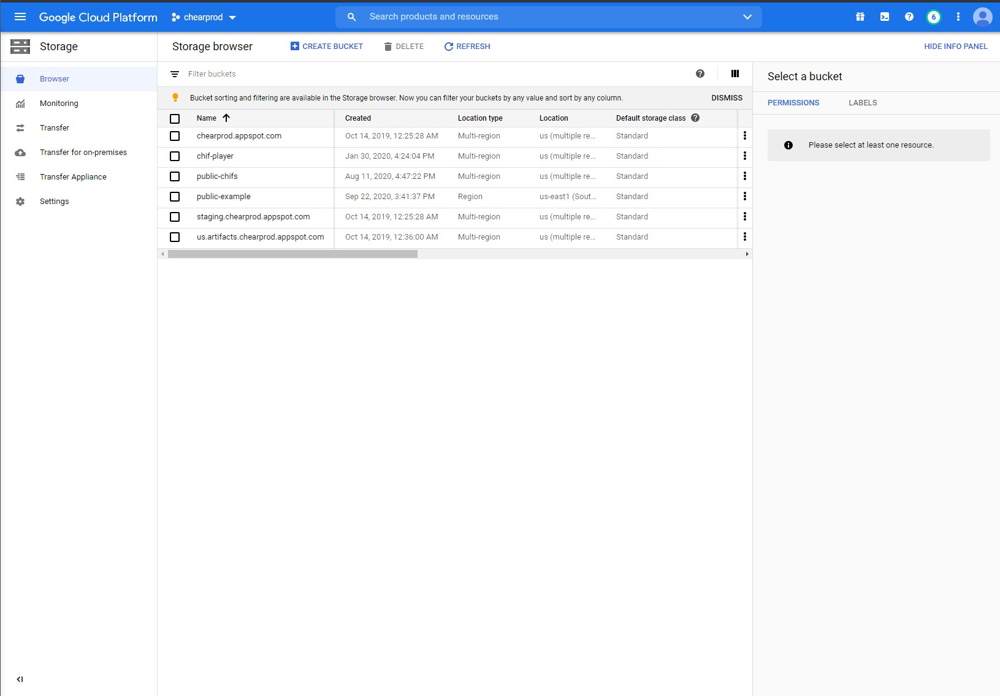

Enter a bucket name and click continue. 

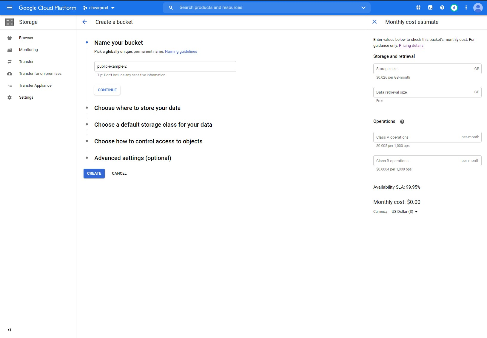

Select a type, location and click continue. 

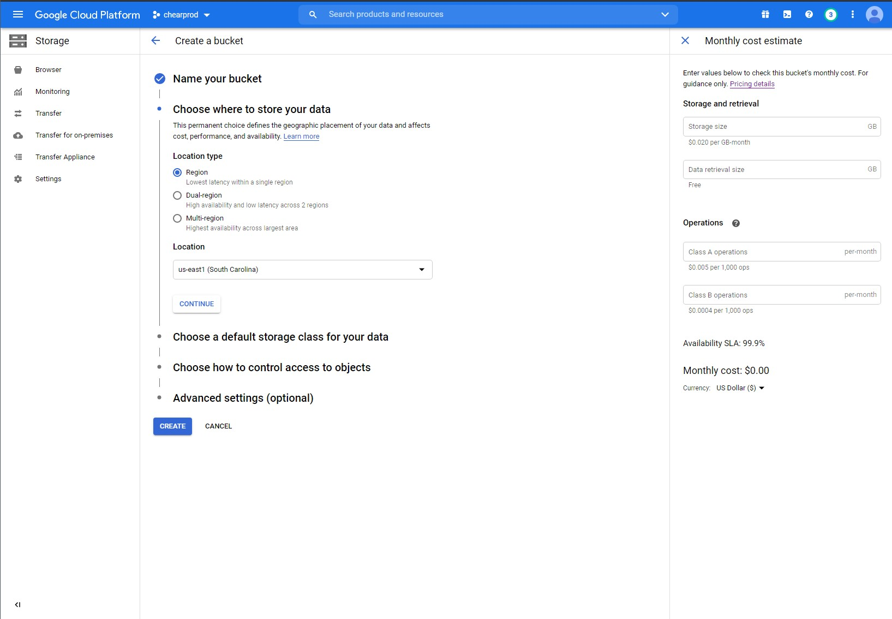

Select a storage class and click continue. 

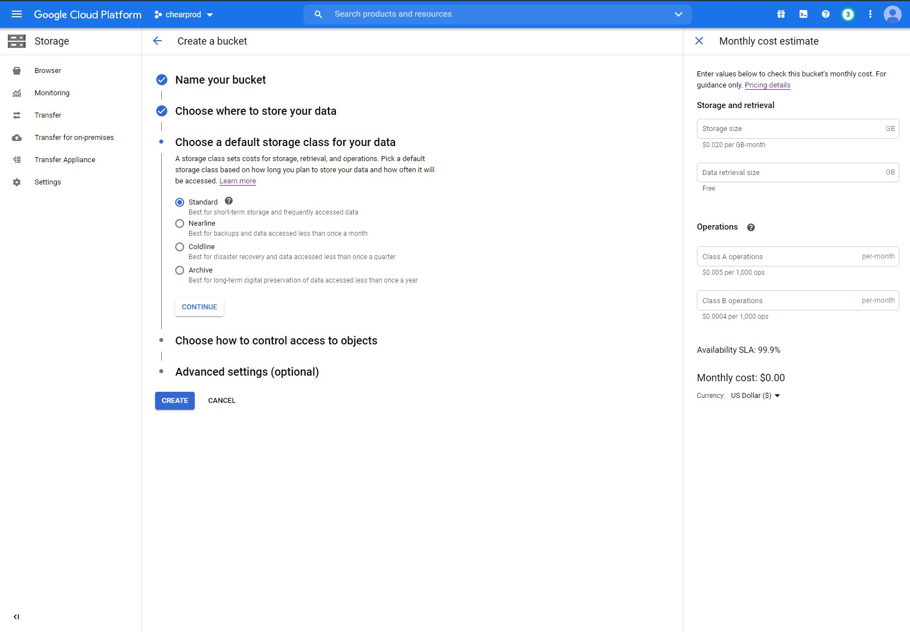

Select `Uniform` access control and click continue. 

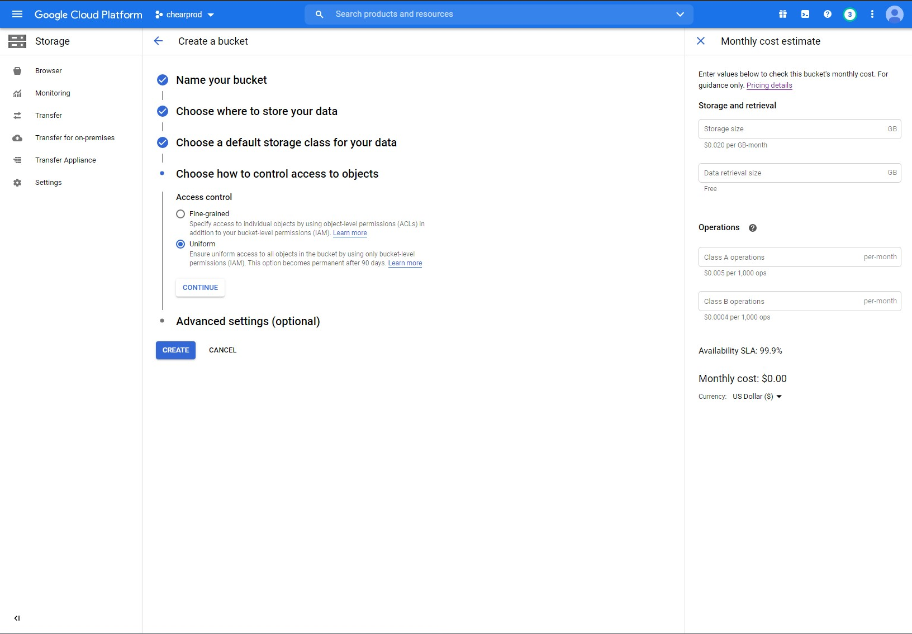

Select google managed and click continue. 

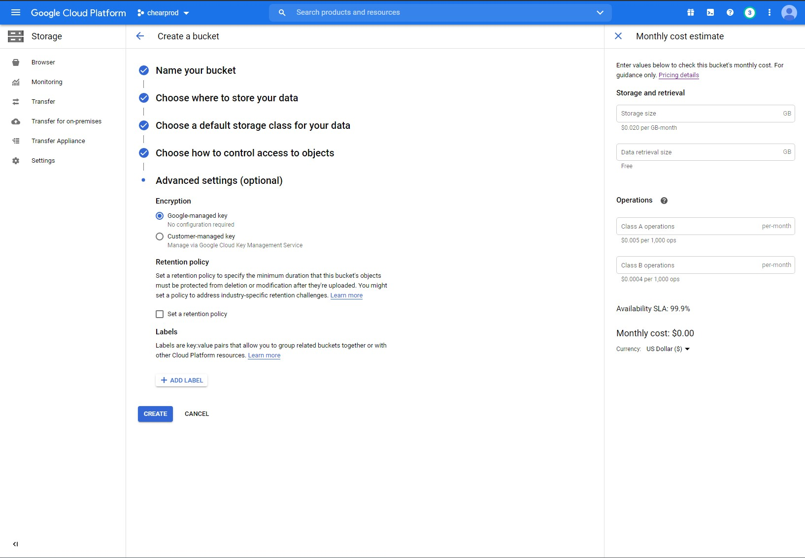

Click `Create`

In order for a website to access your CHIFS we need to update the bucket permissions.

## Storage Permissions

Select the permissions tab and click add permission.

1. Type `allUsers` in th new members text input and select it.

2. Click the Role drop down and select `Cloud Storage` => `Storage Object Viewer`

3. Click Save and confirm public access.

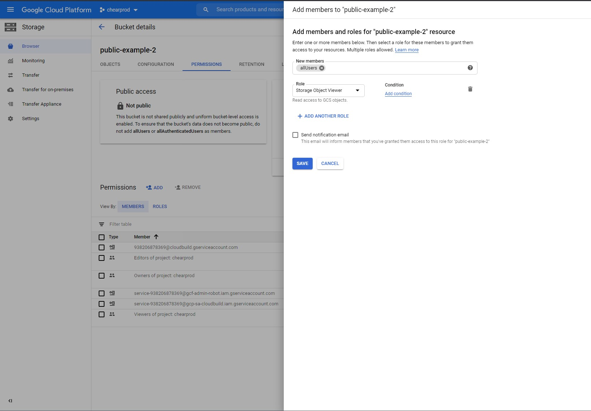

## Upload A CHIF

Select the Objects tab.

Upload your CHIF to the bucket.

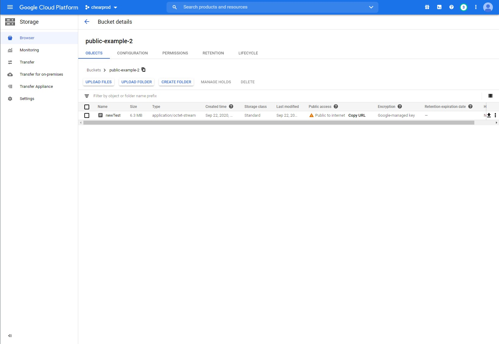

## Get the Media Link

GCP provide CORS enabled links per file called media links. To find these links you can list your bucket useing the following structure and replace `your-bucket-name` or add `your-chif-name` for only the file information. Take the url and enter it into a new browser tab.

Bucket List => `https://storage.googleapis.com/storage/v1/b/{your-buckt-name}/o`

File Info => `https://www.googleapis.com/storage/v1/b/{your-buckt-name}/o/{your-chif-name}`

Find your CHIF and copy the `mediaLink` value.

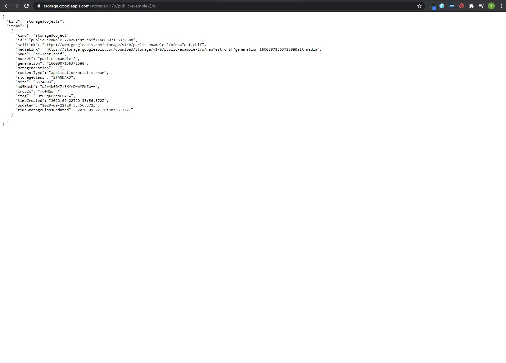

Now you are ready to use your CHIF. 
