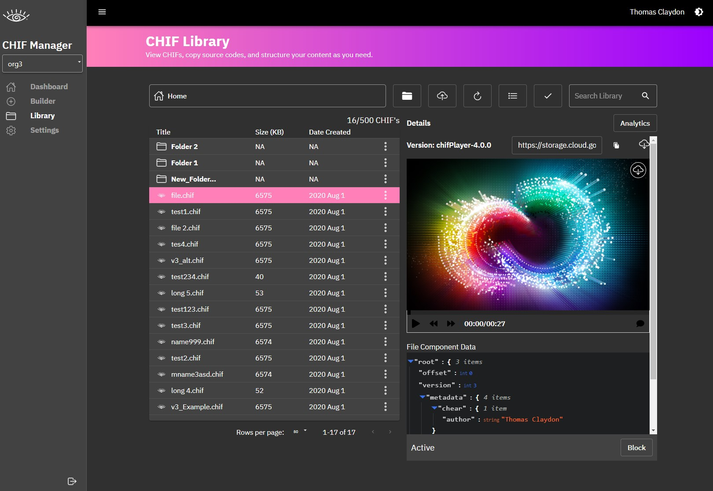

## Player Versions
1. Follow the link to the manager library page.
* [Current Player Version](https://manager.c-hear.com/chif_library)
2. Select a file and locate the `current version` of the player.

3. Copy the `version number` or `download` the player file.
4. In order to use the player either use the provided `public url` with the current version or `Download` the file and reference the player file.
